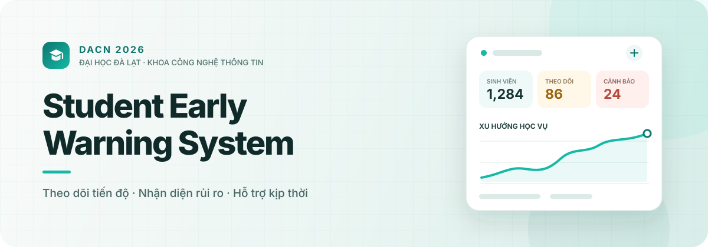
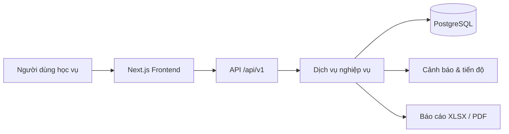

  <picture>
    <source media="(prefers-color-scheme: dark)" srcset="./assets/hero-dark.svg">
    <source media="(prefers-color-scheme: light)" srcset="./assets/hero-light.svg">
    
  </picture>

   
  <strong>Dữ liệu đúng lúc · Cảnh báo đúng người · Hỗ trợ đúng cách</strong>
    
  
  
  

## Về DACN 2026

**DACN 2026** phát triển các giải pháp số hỗ trợ công tác học vụ tại **Khoa Công nghệ Thông tin, Trường Đại học Đà Lạt**. Dự án trọng tâm của nhóm là **SEWS — Student Early Warning System**, một nền tảng hợp nhất dữ liệu học tập để giúp cán bộ nhận diện sớm sinh viên cần được quan tâm và đưa ra hỗ trợ kịp thời.

> Công nghệ là công cụ. Mục tiêu cuối cùng là giúp mỗi sinh viên có thêm cơ hội hoàn thành hành trình học tập của mình.

## Dự án trọng tâm

<table>
  <tr>
    <td width="64" align="center">🎓</td>
    <td>
      <h3><a href="https://github.com/DACN-2026/student-ews">student-ews</a></h3>
      
Hệ thống theo dõi học vụ và cảnh báo sớm sinh viên, từ dữ liệu phân tán đến góc nhìn hành động được.

      

        
        
        
        
        
      

    </td>
  </tr>
</table>

### Một hệ thống, ba năng lực cốt lõi

| 01 · Quan sát | 02 · Nhận diện | 03 · Đồng hành |
| :--- | :--- | :--- |
| Tổng hợp hồ sơ, kết quả học tập và tiến độ chương trình đào tạo. | Áp dụng chính sách cảnh báo có phiên bản để phát hiện rủi ro nhất quán. | Ghi nhận hành động hỗ trợ, báo cáo kết quả và duy trì dấu vết kiểm toán. |

## Nền tảng kỹ thuật

Repository được tổ chức theo **npm workspaces**, tách frontend và backend để có thể phát triển, kiểm thử và triển khai độc lập. Hợp đồng API `/api/v1` giữ ranh giới rõ ràng giữa giao diện, nghiệp vụ và dữ liệu.

## Bắt đầu khám phá

| Bạn muốn… | Điểm bắt đầu |
| :--- | :--- |
| Hiểu hệ thống giải quyết vấn đề gì | [Tổng quan dự án](https://github.com/DACN-2026/student-ews#sews--student-early-warning-system) |
| Nắm kiến trúc và luồng nghiệp vụ | [Tài liệu kiến trúc](https://github.com/DACN-2026/student-ews/blob/main/docs/ARCHITECTURE.md) |
| Chạy dự án trên máy phát triển | [Hướng dẫn cài đặt](https://github.com/DACN-2026/student-ews#chạy-trên-máy-phát-triển) |
| Tìm hiểu cách sử dụng sản phẩm | [Hướng dẫn người dùng](https://github.com/DACN-2026/student-ews/blob/main/docs/USER_GUIDE.md) |

  Built with care in Đà Lạt · 2026

